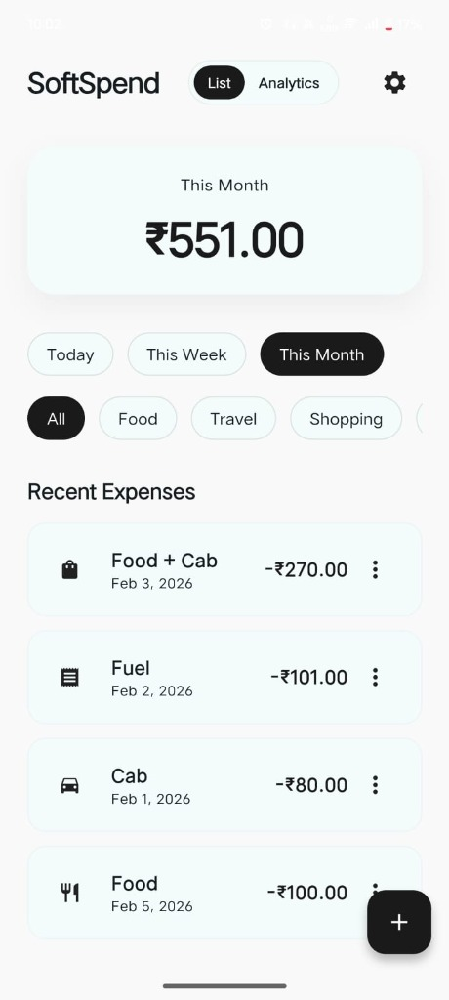
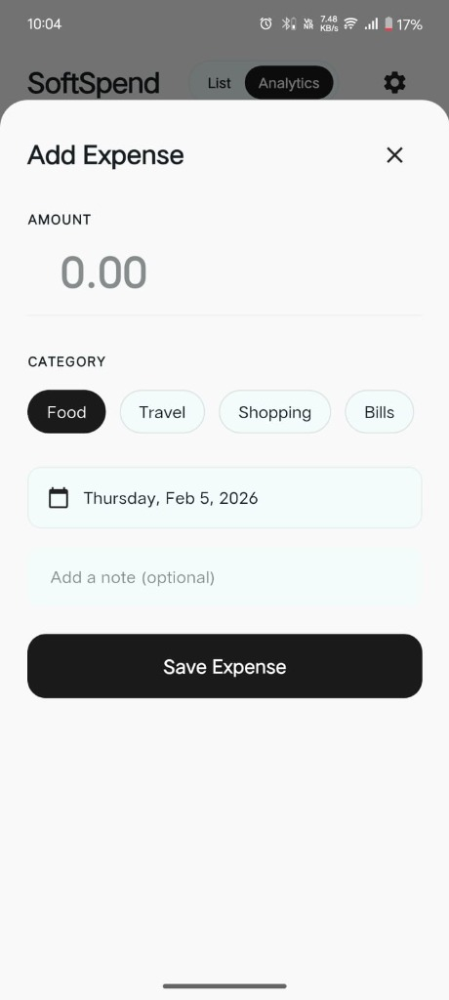
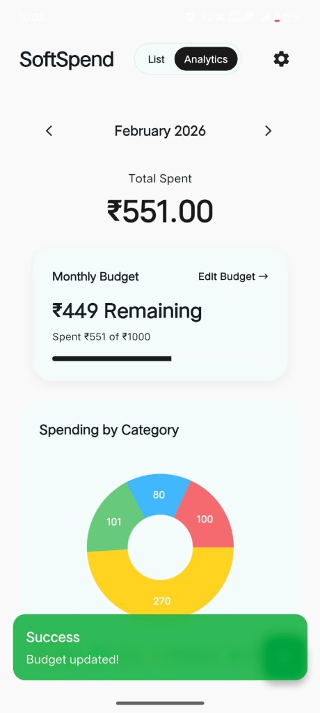
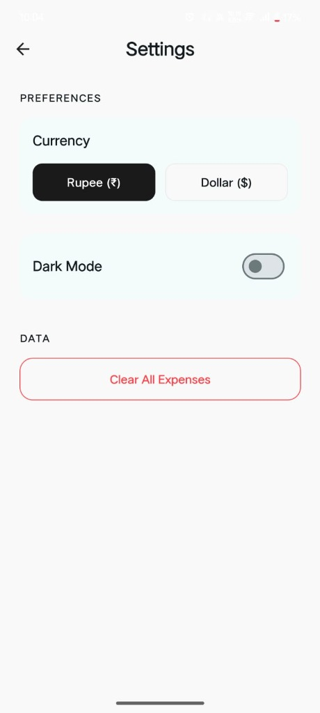

# SoftSpend - Smart Expense Tracker

<div align="center">
  
</div>

<br />

**SoftSpend** is a modern, minimalist, and intelligent expense tracking application built with **Flutter** and **GetX**. Designed for simplicity and aesthetics, it helps users manage their finances, track monthly budgets, and visualize spending habits with beautiful charts and analytics.

---

## ✨ Key Features

-   **💰 Smart Budgeting**: Set monthly budgets and track remaining balance in real-time.
-   **📊 Visual Analytics**: Interactive pie charts and bar graphs to analyze spending patterns.
-   **🏷️ Categorization**: Organize expenses by category (Food, Travel, Shopping, Bills, etc.).
-   **📅 Time Filters**: View expenses by Today, This Week, or This Month.
-   **📱 Modern UI**: Sleek, responsive design with dark mode support.
-   **⚡ Fast & Offline**: Built for performance with local data persistence.

---

## 📸 Screenshots

| Dashboard | Analytics | Add Expense |
|:---:|:---:|:---:|
|  |  |  |

| Budget Settings | App Settings |
|:---:|:---:|
|  |  |

---

## 🛠️ Tech Stack

-   **Framework**: [Flutter](https://flutter.dev/) (Dart)
-   **State Management**: [GetX](https://pub.dev/packages/get)
-   **Local Storage**: [GetStorage](https://pub.dev/packages/get_storage)
-   **Charting**: [fl_chart](https://pub.dev/packages/fl_chart)
-   **Date Formatting**: [intl](https://pub.dev/packages/intl)

---

## 🚀 Getting Started

Follow these steps to run the project locally.

### Prerequisites

-   Flutter SDK installed ([Installation Guide](https://docs.flutter.dev/get-started/install))
-   Dart installed
-   An IDE (VS Code or Android Studio)

### Installation

1.  **Clone the repository**
    ```bash
    git clone https://github.com/YOUR_USERNAME/SoftSpend.git
    cd SoftSpend
    ```

2.  **Install dependencies**
    ```bash
    flutter pub get
    ```

3.  **Run the app**
    ```bash
    flutter run
    ```

---

## 🔮 Future Improvements

-   [ ] Cloud Sync (Firebase/Supabase Integration)
-   [ ] Multi-currency support
-   [ ] Export to CSV/PDF
-   [ ] Recurring expenses

---

<div align="center">
  Built with ❤️ using Flutter
</div>
